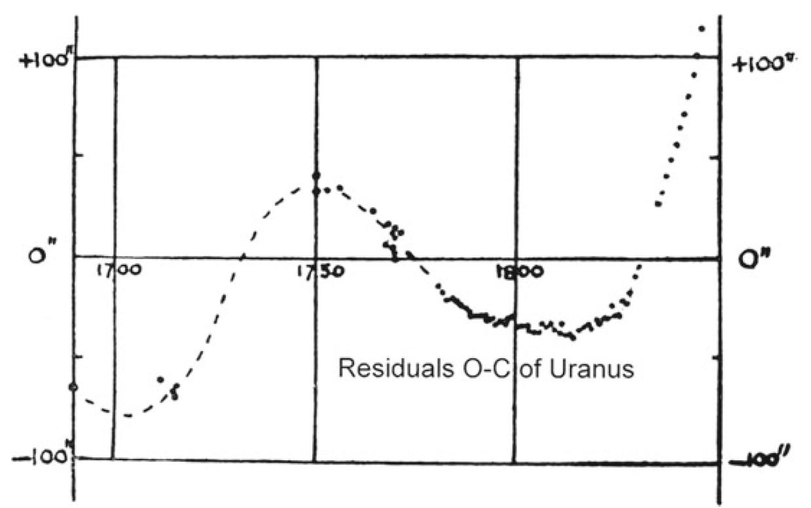
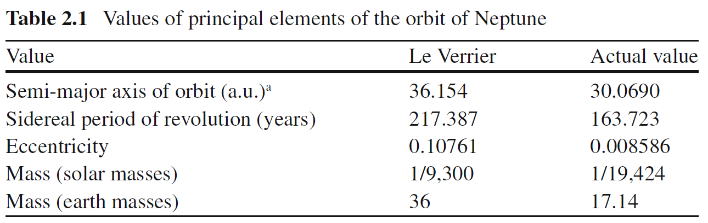

::: {.hero}

```{=html}
<h1>The Calculus of Neptune</h1>
<h2>A Mathematical Detective Story</h2>

<p><strong>Joel Tang Yi Xian · Yeong Zhi Perng · Ngae Kie Siong</strong></p>

<h3>Can mathematics discover a planet before anyone sees it?</h3>

<p><em>Using calculus to uncover an invisible world.</em></p>

<div class="scroll-down">↓ Scroll to Begin</div>
```
:::


::: {.callout-note title="Abstract"}
This paper retraces the mathematical journey that led to the discovery of Neptune in 1846. Starting from unexplained deviations in Uranus's orbit, we follow the steps astronomers took to quantify the discrepancy, describe planetary motion using parametric equations, and apply calculus to uncover the presence of an unseen world. Through differentiation, Taylor series, and differential equations, we show how mathematics transformed tiny observational anomalies into the prediction of a new planet.
:::

# Introduction

Imagine discovering an entirely new planet without ever seeing it through a telescope. It sounds impossible, yet this is exactly what happened in the nineteenth century. Long before anyone laid eyes on Neptune, mathematicians had already predicted its existence using nothing more than observations, Newton's laws, and the power of calculus.

The story began in 1781 when William Herschel discovered Uranus, the first planet ever found with a telescope. At first, astronomers believed that Newton's law of universal gravitation could perfectly predict its orbit. However, as more observations were collected over the following decades, they noticed something unsettling: Uranus was never exactly where mathematics said it should be. The differences were tiny at first, but they became larger and more systematic with time. It was as if an invisible hand was gently pulling the planet away from its predicted path.

By the 1820s, the French astronomer Alexis Bouvard had published tables predicting Uranus' orbit. When repeated observations continued to disagree with his calculations, he proposed a bold idea: perhaps another, unknown planet beyond Uranus was disturbing its motion through gravity. This mysterious clue marked the beginning of one of the greatest mathematical investigations in the history of astronomy.

In the 1840s, two brilliant mathematicians independently took up the challenge: the 24-year-old English mathematician John Couch Adams and the 35-year-old French mathematician Urbain Le Verrier. Their task was far from simple. They faced the famous three-body problem, in which the Sun, Uranus, and an unseen planet all exert gravitational forces on one another. Since no general closed-form solution exists for this problem, they turned to perturbation theory. Instead of solving the impossible system directly, they first calculated Uranus' normal orbit under the Sun's gravity and then treated the unknown planet as a small perturbation that slightly altered its path.

For months, they performed thousands of calculations entirely by hand, carefully analysing the systematic deviations in Uranus' orbit. From these tiny irregularities, they estimated the unknown planet's orbital distance, approximate mass, and position in the night sky.

In 1845, Adams sent his prediction to the Astronomer Royal, Sir George Airy, but it received little attention. One year later, Le Verrier independently completed his own calculations and mailed his predicted coordinates to Johann Galle at the Berlin Observatory.

On the evening of 23 September 1846, Galle pointed his telescope toward the exact location calculated by Le Verrier. Less than an hour later, he found a faint blue planet less than one degree from the predicted position. The invisible world described by mathematics had become a real celestial object. It was later named **Neptune**.

The story contains one final surprise. Historians later discovered that Galileo Galilei had actually observed Neptune in 1612 and 1613. Because the planet moved so slowly across the sky, he mistakenly recorded it as a fixed star. More than two centuries passed before mathematics revealed what the telescope alone had overlooked.

Neptune is often called **"the planet discovered with the tip of a pen"** because it was the first planet whose existence was predicted before it was ever seen. By combining calculus, Newtonian mechanics, perturbation theory, and careful astronomical observations, scientists transformed tiny errors in Uranus' orbit into convincing evidence of an entirely new world. This remarkable achievement showed that mathematics is not merely a language for describing the universe—it is also a powerful tool for uncovering the invisible.

# The Mystery Begins

In 1781, William Herschel discovered Uranus. It was the first planet ever found with a telescope, and astronomers were thrilled. But that excitement quickly turned to confusion.

Uranus was not following its predicted path.

Year after year, its actual position in the sky was slightly different from where Newton's laws said it should be. The difference grew larger over time. By the 1820s, the French astronomer Alexis Bouvard threw up his hands and declared: "Either Newton's laws are wrong, or something invisible is pulling on Uranus."

That *something invisible* became the greatest mystery in astronomy.

The first thing astronomers needed was a way to measure the problem. They couldn't work with vague descriptions like "a little to the left." They needed numbers. So they defined the discrepancy:

$$
\Delta\phi = \phi_{\text{obs}} - \phi_{\text{pred}}
$$

Here, $\phi_{\text{obs}}$ is the actual position seen through a telescope, and $\phi_{\text{pred}}$ is the position calculated from Newton's laws. Their difference, $\Delta\phi$, was the error.

When astronomers collected observations spanning many decades, the residuals between Uranus's observed and predicted positions formed a systematic pattern rather than random measurement errors. As shown in Figure 1, the residuals varied smoothly over time and became increasingly significant, suggesting that another planet was perturbing Uranus's orbit.

{width=75% fig-cap="Historical residuals (Observed and Computed) of Uranus's orbital longitude from approximately 1690 to 1846.[SpaceEngine, 2019]"}

The systematic deviations between the observed and predicted positions suggested the gravitational influence of an unknown planet. The graph includes both observations made after Uranus was discovered in 1781 and earlier pre-discovery observations that were identified retrospectively. These historical records allowed astronomers to reconstruct Uranus's orbit over a much longer period, making the systematic deviations easier to recognize.

The error was real, it was growing, and it followed a regular pattern. This was not a mistake in measurement. Something was pulling on Uranus. But what? And where was it?

To answer that, astronomers first needed to know exactly where Uranus should be if nothing else was affecting it.

# Predicting Uranus

To prove something is wrong, you must first show what "right" looks like. Astronomers needed a way to calculate Uranus's position at any time, assuming no unknown planet existed.

For simplicity, Uranus's slightly elliptical orbit is approximated as a circular orbit. Since its orbital eccentricity is relatively small (approximately 0.047), this approximation is sufficient for illustrating the calculus concepts used in this project. In this simplified model, the planet moves with constant angular velocity, so its angular position is given by

$$
\theta=\omega t,
$$

where $\omega$ is the angular velocity.

If we place the Sun at the origin, the planet's position is given by parametric equations:

$$
x = R\cos(\omega t), \qquad y = R\sin(\omega t)
$$

For Uranus, astronomers already knew the measured values: the orbital radius was $R_1 = 19.19$ AU (astronomical units), and the orbital period was $T_1 = 84.01$ years. From this, the angular velocity was:

$$
\omega_1 = \frac{2\pi}{T_1} = \frac{2\pi}{84.01} = 7.479\times10^{-2} \text{ rad/yr}
$$

Plugging these numbers in, they could predict Uranus's position at any time:

$$
x_{\text{pred}}(t) = 19.19\cos(7.479\times10^{-2} \, t)
$$

$$
y_{\text{pred}}(t) = 19.19\sin(7.479\times10^{-2} \, t)
$$

Let's test this. Suppose we want to find Uranus's position exactly one year after our starting point ($t = 1$ year):

$$
x = 19.19\cos(7.479\times10^{-2})
$$

Since $7.479\times10^{-2}$ is a small angle (about 4.29 degrees), $\cos(7.479\times10^{-2}) \approx 0.9972$:

$$
x \approx 19.19 \times 0.9972 = 19.136 \text{ AU}
$$

$$
y = 19.19\sin(7.479\times10^{-2}) \approx 19.19 \times 0.0748 = 1.435 \text{ AU}
$$

So after one year, Uranus has moved only slightly from its starting position — about 1.435 AU vertically while staying nearly the same horizontally. This makes sense because Uranus takes 84 years to complete one full orbit.

After one quarter of an orbit ($t = T_1/4 = 21.0025$ years), the angle is $\omega_1 t = 2\pi \times (1/4) = \pi/2$ radians:

$$
x = 19.19\cos(\pi/2) = 0
$$

$$
y = 19.19\sin(\pi/2) = 19.19 \text{ AU}
$$

So after 21 years, Uranus has moved to the top of its circular orbit, at position $(0, 19.19)$.

Now astronomers had a clear prediction: this is where Uranus *should* be if nothing else is pulling on it.

When they compared this predicted position with telescope observations, they found the two did not match. The difference was exactly the $\Delta\phi$ they had measured before. The predictions and observations diverged more and more each year.

Something was definitely pulling Uranus off its expected path. But to find the puller, astronomers needed to know not just where Uranus was, but how fast it was moving and how that speed was changing. That meant velocity and acceleration. That meant calculus.

## 🌌 Explore the Real Solar System

The model above is simplified for Calculus II.  
If you want to explore the actual Solar System interactively, try NASA's 3D Solar System model below.

```{=html}
<iframe
  src="https://eyes.nasa.gov/apps/solar-system/#/?embed=true"
  width="100%"
  height="700"
  style="border:none; border-radius:18px;"
  allowfullscreen>
</iframe>
```

::: {.callout-note}
## Try This

Use the NASA model to compare the motion of Uranus and Neptune.  
Notice how slowly Neptune moves compared with Uranus.
:::

# Calculus Enters the Story

Newton's second law says $F = ma$ — force equals mass times acceleration. To find the unknown force pulling on Uranus, astronomers needed acceleration. But they only had position.

Calculus connects position to acceleration through differentiation. Velocity is the rate of change of position — the first derivative. Acceleration is the rate of change of velocity — the second derivative.

Starting from the position equations:

$$
x = R\cos(\omega t), \qquad y = R\sin(\omega t)
$$

**Step 1: Calculate velocity (first derivative).**

Using the chain rule: the derivative of $\cos(\omega t)$ with respect to $t$ is $-\omega\sin(\omega t)$.

$$
v_x = \frac{dx}{dt} = -R\omega\sin(\omega t)
$$

Similarly, the derivative of $\sin(\omega t)$ with respect to $t$ is $\omega\cos(\omega t)$.

$$
v_y = \frac{dy}{dt} = R\omega\cos(\omega t)
$$

**Step 2: Calculate acceleration (second derivative).**

Now differentiate velocity to get acceleration:

$$
a_x = \frac{dv_x}{dt} = -R\omega^2\cos(\omega t)
$$

$$
a_y = \frac{dv_y}{dt} = -R\omega^2\sin(\omega t)
$$

Let's work through a numerical example to see what this means.

**At $t = 0$** (starting point, Uranus at position $(R, 0)$):

\begin{table}[H]
\centering
\begin{tabular}{lcc}
\toprule
Quantity & Formula & Value at $t=0$ \\
\midrule
Position $x$ & $R\cos(\omega t)$ & $R$ \\
Position $y$ & $R\sin(\omega t)$ & $0$ \\
Velocity $v_x$ & $-R\omega\sin(\omega t)$ & $0$ \\
Velocity $v_y$ & $R\omega\cos(\omega t)$ & $R\omega$ \\
Acceleration $a_x$ & $-R\omega^2\cos(\omega t)$ & $-R\omega^2$ \\
Acceleration $a_y$ & $-R\omega^2\sin(\omega t)$ & $0$ \\
\bottomrule
\end{tabular}
\caption{Position, velocity, and acceleration at $t=0$.}
\end{table}

**Interpretation:** At $t=0$, Uranus is at the far right of its orbit. Its velocity is entirely upward ($v_y = R\omega$), and its acceleration is entirely leftward ($a_x = -R\omega^2$) — pulling it toward the center. This is exactly what we expect for circular motion: the velocity is tangent to the circle, and the acceleration points toward the center.

**At $t = T/4 = 21$ years** (one quarter orbit, Uranus at position $(0, R)$):

\begin{table}[H]
\centering
\begin{tabular}{lcc}
\toprule
Quantity & Formula & Value at $t=T/4$ \\
\midrule
Position $x$ & $R\cos(\omega t)$ & $0$ \\
Position $y$ & $R\sin(\omega t)$ & $R$ \\
Velocity $v_x$ & $-R\omega\sin(\omega t)$ & $-R\omega$ \\
Velocity $v_y$ & $R\omega\cos(\omega t)$ & $0$ \\
Acceleration $a_x$ & $-R\omega^2\cos(\omega t)$ & $0$ \\
Acceleration $a_y$ & $-R\omega^2\sin(\omega t)$ & $-R\omega^2$ \\
\bottomrule
\end{tabular}
\caption{Position, velocity, and acceleration at $t=T/4$.}
\end{table}

**Interpretation:** At the top of the orbit, velocity is leftward, and acceleration is downward toward the center.

Now plug in Uranus's actual numbers: $R_1 = 19.19$ AU and $\omega_1 = 7.479\times10^{-2}$ rad/yr.

**Velocity magnitude** (speed along the orbit):

$$
v = R_1\omega_1 = 19.19 \times 7.479\times10^{-2} = 1.435 \text{ AU/yr}
$$

This means Uranus travels about 1.435 AU (about 215 million kilometers) every year.

**Acceleration magnitude** (toward the Sun):

$$
a = R_1\omega_1^2 = 19.19 \times (7.479\times10^{-2})^2 = 0.1074 \text{ AU/yr}^2
$$

With these values, astronomers could calculate the gravitational force from the Sun alone:

$$
F_{\text{Sun}} = m_1 a
$$

But when they compared this to the force needed to explain Uranus's actual motion, they didn't match. There was an extra force — exactly the amount needed to explain the growing discrepancy $\Delta\phi$.

The extra force was real. It had to come from somewhere. And if it came from a planet, astronomers were now facing a three-body problem: Sun, Uranus, and the unknown planet. Three-body problems have no exact solution. No formula exists that gives the positions of all three bodies at all times.

They needed another approach.

# A Small Perturbation

The general three-body problem has no known closed-form analytical solution because the bodies continuously influence one another through gravity. However, some special cases do admit exact solutions. But astronomers noticed something important: the unknown planet had to be much smaller than the Sun. Its gravitational pull on Uranus would be tiny compared to the Sun's.

This meant they could treat the unknown planet's influence as a small perturbation — a tiny correction to the main orbit. Instead of solving the impossible three-body problem, they could start with the easy two-body problem (Sun and Uranus) and then add small corrections.

To understand the effect mathematically, we introduce small perturbations around the circular orbit.
The following perturbation model is a simplified mathematical representation inspired by modern perturbation theory. Although Adams and Le Verrier used more sophisticated celestial mechanics in their original calculations, this simplified model captures the essential calculus concepts needed to explain how small gravitational perturbations affect Uranus's orbit.

Let $R_1$ denote the radius of Uranus's unperturbed circular orbit, and let $\omega_1$ be its constant angular velocity in the simplified model.

$$
\rho_1(\tau) = R_1 + u(\tau)
$$

$$
\phi_1(\tau) = \omega_1\tau + \frac{v(\tau)}{R_1}
$$

Here, $R_1$ and $\omega_1\tau$ represent the normal orbit — where Uranus would be if only the Sun existed. The small corrections are $u(\tau)$ (a tiny radial shift, pulled in or out) and $v(\tau)$ (a tiny tangential shift, pulled forward or backward). The variable $\tau = t - 1822$ measures time from the year when Uranus and Neptune were aligned.

Let's check that this is valid. How small are $u$ and $v$?

The observed discrepancy $\Delta\phi$ was about 74 arcseconds by 1845. In radians, this is:

$$
74 \text{ arcseconds} = 74 \times \frac{\pi}{180 \times 3600} = 3.588\times10^{-4} \text{ radians}
$$

Since $\Delta\phi = v/R_1$, the tangential perturbation is:

$$
v = R_1 \times \Delta\phi = 19.19 \times 3.588\times10^{-4} = 6.884\times10^{-3} \text{ AU}
$$

Compare this to $R_1 = 19.19$ AU:

$$
\frac{v}{R_1} = \frac{6.884\times10^{-3}}{19.19} = 3.588\times10^{-4} \approx 0.036\%
$$

The perturbation is indeed tiny — less than 0.04\% of the orbital radius.

The problem was now much simpler. Instead of finding the entire orbit, astronomers only needed to find the small corrections $u$ and $v$. If they could find $v$, they would know exactly how much the unknown planet was pulling Uranus off its predicted path.

But to find $u$ and $v$, they had to substitute this perturbed orbit into Newton's law. And that's where a new problem appeared.

# Taylor Series to the Rescue

In the simplified perturbation model introduced in this report, substituting $\rho = R + u$ into Newton's law of gravitation produces the inverse-square term
  

$$
\frac{1}{(R+u)^2}
$$

To simplify the perturbation equations, we approximate the inverse-square term using a Taylor series. Historically, Adams and Le Verrier derived the perturbation equations from the complete Newtonian gravitational potential. We expand only the inverse-square term because it illustrates the key calculus concept while keeping the mathematics suitable for a Calculus II level.

$$
\frac{1}{(R+u)^2}=\frac{1}{R^2(1+\frac{u}{R})^2}
$$

And finally,

$$
\frac{1}{(R+u)^2}\approx\frac{1}{R^2}-\frac{2u}{R^3}
$$

The inverse-square term is difficult to manipulate because the perturbation u appears in the denominator. Since u is assumed to be much smaller than R, the Taylor series provides an excellent approximation.

Let's derive the Taylor expansion step by step.

We want to expand $(1+x)^{-2}$ around $x = 0$. The Taylor series formula is:

$$
f(x) = f(0) + f'(0)x + \frac{f''(0)}{2!}x^2 + \frac{f'''(0)}{3!}x^3 + \cdots
$$

For $f(x) = (1+x)^{-2}$:

\begin{table}[H]
\centering
\begin{tabular}{lcc}
\toprule
Term & Calculation & Value at $x=0$ \\
\midrule
$f(0)$ & $(1+0)^{-2}$ & $1$ \\
$f'(x)$ & $-2(1+x)^{-3}$ & $-2$ \\
$f''(x)$ & $6(1+x)^{-4}$ & $6$ \\
$f'''(x)$ & $-24(1+x)^{-5}$ & $-24$ \\
\bottomrule
\end{tabular}
\caption{Derivatives of $f(x) = (1+x)^{-2}$ at $x=0$.}
\end{table}

So:

$$
(1+x)^{-2} = 1 - 2x + 3x^2 - 4x^3 + \cdots
$$

Now substitute $x = u/R$:

$$
\left(1 + \frac{u}{R}\right)^{-2} = 1 - 2\left(\frac{u}{R}\right) + 3\left(\frac{u}{R}\right)^2 - 4\left(\frac{u}{R}\right)^3 + \cdots
$$

Since $u/R \approx 0.0004$, let's estimate the size of each term:

\begin{table}[H]
\centering
\begin{tabular}{lc}
\toprule
Term & Magnitude \\
\midrule
$1$ & $1$ \\
$2(u/R)$ & $8\times10^{-4}$ \\
$3(u/R)^2$ & $4.8\times10^{-7}$ \\
$4(u/R)^3$ & $2.6\times10^{-10}$ \\
\bottomrule
\end{tabular}
\caption{Magnitude of each term in the Taylor expansion.}
\end{table}

The second term is 1000 times smaller than the first. The third term is 1000 times smaller than the second. So we can safely ignore everything beyond the first two terms:

$$
\left(1 + \frac{u}{R}\right)^{-2} \approx 1 - \frac{2u}{R}
$$

Applying this to the gravitational term:

$$
\frac{1}{(R+u)^2} = \frac{1}{R^2} \left(1 + \frac{u}{R}\right)^{-2} \approx \frac{1}{R^2} \left(1 - \frac{2u}{R}\right) = \frac{1}{R^2} - \frac{2u}{R^3}
$$

The complicated nonlinear expression $\frac{1}{(R+u)^2}$ had become the simple linear expression $\frac{1}{R^2} - \frac{2u}{R^3}$. This was a massive simplification. A problem that was nearly impossible to solve had become manageable.

Let's test the accuracy of this approximation with actual numbers. For Uranus, $R = 19.19$ AU and suppose $u = 0.007$ AU:

**Exact value:**

$$
\frac{1}{(19.197)^2} = \frac{1}{368.524} = 0.0027138
$$

**Approximation:**

$$
\frac{1}{19.19^2} - \frac{2(0.007)}{19.19^3} = \frac{1}{368.256} - \frac{0.014}{7068.5}
$$

$$
= 0.0027155 - 1.981\times10^{-6} = 0.0027135
$$

**Error:** $0.0027138 - 0.0027135 = 0.0000003$, which is less than 0.01\%.

This is the power of Taylor series: they turn hard nonlinear problems into easy linear ones with negligible error. And this was exactly what astronomers needed to move forward.

# The Differential Equation
**Coupled Linear Differential Equations**
A system of coupled ordinary differential equations (ODEs) involves multiple dependent variables whose derivatives depend on one another. In classical mechanics, a general second-order linear coupled system with two variables, $u(t)$ and $v(t)$, takes the form:

$$$
\begin{aligned}
\ddot{u} + c_1 \dot{v} + c_2 u &= f_1(t) \\
\ddot{v} + c_3 \dot{u} + c_4 v &= f_2(t)
\end{aligned}
$$

Because the rate of change of $u$ depends on the velocity of $v$ (and vice versa), these equations cannot be solved in isolation; they must be solved simultaneously.

**Role in this Project:** In our model, $u(\tau)$ and $v(\tau)$ represent Uranus's radial and tangential displacements. The coupling terms ($2\omega_1\dot{v}$ and $2\omega_1\dot{u}$) mathematically represent the physical Coriolis effect, showing how a structural shift in one direction instantly forces a dynamic velocity change in the perpendicular direction.

With the gravitational term simplified, astronomers could now substitute everything into Newton's law. Let's walk through the derivation.

In polar coordinates, the acceleration has two components:
- Radial: $a_r = \ddot{\rho} - \rho\dot{\phi}^2$
- Tangential: $a_\phi = \rho\ddot{\phi} + 2\dot{\rho}\dot{\phi}$
Where dots represent derivatives with respect to time: $\dot{\rho} = d\rho/dt$, $\ddot{\rho} = d^2\rho/dt^2$.

Newton's law $F = ma$ gives:

$$
F_r = m(\ddot{\rho} - \rho\dot{\phi}^2)
$$

$$
F_\phi = m(\rho\ddot{\phi} + 2\dot{\rho}\dot{\phi})
$$

**Step 1: Substitute the perturbed orbit.**

Recall that $\rho = R_1 + u$ and $\phi = \omega_1\tau + v/R_1$.

First, compute the derivatives:

$$
\dot{\rho} = \dot{u},  \qquad \ddot{\rho} = \ddot{u}
$$

$$
\dot{\phi} = \omega_1 + \frac{\dot{v}}{R_1}, \qquad \ddot{\phi} = \frac{\ddot{v}}{R_1}
$$

**Step 2: Substitute into the radial equation.**

$$
F_r = \ddot{u} - (R_1+u)\left(\omega_1 + \frac{\dot{v}}{R_1}\right)^2
$$

Expand the squared term:

$$
\left(\omega_1 + \frac{\dot{v}}{R_1}\right)^2 = \omega_1^2 + \frac{2\omega_1\dot{v}}{R_1} + \frac{\dot{v}^2}{R_1^2}
$$

Since $\dot{v}^2$ is tiny (perturbation squared), we ignore it:

$$
\left(\omega_1 + \frac{\dot{v}}{R_1}\right)^2 \approx \omega_1^2 + \frac{2\omega_1\dot{v}}{R_1}
$$

Now multiply by $(R_1+u)$:

$$
(R_1+u)\left(\omega_1^2 + \frac{2\omega_1\dot{v}}{R_1}\right) = R_1\omega_1^2 + 2\omega_1\dot{v} + u\omega_1^2 + \frac{2u\omega_1\dot{v}}{R_1}
$$

The last term is tiny (product of two small quantities), so we ignore it:

$$
(R_1+u)\left(\omega_1^2 + \frac{2\omega_1\dot{v}}{R_1}\right) \approx R_1\omega_1^2 + 2\omega_1\dot{v} + u\omega_1^2
$$

Thus:

$$
F_r = \ddot{u} - R_1\omega_1^2 - 2\omega_1\dot{v} - u\omega_1^2
$$

**Step 3: Account for gravity.**

The Sun's gravitational acceleration acting on Uranus is given by Newton's law of gravitation. Since the Sun's mass is much greater than Uranus's mass ($M\gg m_1$), Uranus's mass is neglected when calculating the orbital acceleration.

The Sun's gravitational force (with Taylor expansion):

$$
F_{\text{Sun}} = \frac{GM}{(R_1+u)^2} \approx \frac{GM}{R_1^2} - \frac{2uGM}{R_1^3}
$$

For the unperturbed orbit, we know that:

$$
\frac{GM}{R_1^2} = R_1\omega_1^2 \implies \frac{GM}{R_1^3} = \omega_1^2
$$

This means the Sun's force exactly balances the centripetal acceleration needed for circular motion.

**Step 4: Combine everything.**

The full radial equation is:

$$
\ddot{u} - R_1\omega_1^2 - 2\omega_1\dot{v} - u\omega_1^2 = -\frac{GM}{R_1^2} + \frac{2uGM}{R_1^3} + F_{\text{perturb}}
$$

But the terms $-R_1\omega_1^2$ and $-\frac{GM}{R_1^2}$ cancel (they are equal and opposite).

Also, $\frac{GM}{R_1^3} = \omega_1^2$.

So we get:

$$
\ddot{u} - 2\omega_1\dot{v} - u\omega_1^2 = 2u\omega_1^2 + F_{\text{perturb}}
$$

$$
\ddot{u} - 2\omega_1\dot{v} - 3\omega_1^2 u = F_{\text{perturb}}
$$

**Step 5: The tangential equation follows similarly.**

$$
F_\phi = (R_1+u)\left(\frac{\ddot{v}}{R_1}\right) + 2\dot{u}\left(\omega_1 + \frac{\dot{v}}{R_1}\right)
$$

Ignoring tiny terms:

$$
F_\phi = \ddot{v} + 2\omega_1\dot{u}
$$

Thus, the full system of differential equations is:

$$
\ddot{u} - 2\omega_1\dot{v} - 3\omega_1^2 u = F_r
$$

$$
\ddot{v} + 2\omega_1\dot{u} = F_\phi
$$

Here, $F_r$ and $F_\phi$ represent the gravitational pull from the unknown planet.

**Step 6: Interpret the equations.**
- The first equation describes how the radial perturbation $u$ evolves. The term $-3\omega_1^2 u$ acts like a restoring force — if Uranus is pulled outward ($u > 0$), gravity pulls it back.
- The second equation describes how the tangential perturbation $v$ evolves. The terms $2\omega_1\dot{u}$ are Coriolis-like terms that arise naturally because the equations are expressed in a rotating polar coordinate system. These terms describe the coupling between the radial and tangential perturbations rather than a separate physical force acting on Uranus.
These equations were the key to everything. If astronomers could solve for $u$ and $v$, they would know exactly how the unknown planet was pulling Uranus off its path.

# Finding the Dominant Term
**Simple Introduction:** Fourier Series Expansion

A Fourier series represents a periodic function as an infinite sum of sine and cosine functions, repeating function $f(t)$ with a fundamental frequency $\omega$ into an infinite sum of harmonically related sine and cosine waves. The general expansion is given by:

$$
f(t) = a_0 + \sum_{n=1}^{\infty} a_n \cos(n\omega t) + \sum_{n=1}^{\infty} b_n \sin(n\omega t)
$$

where the coefficients $a_n$ and $b_n$ represent the amplitude or weight of each specific harmonic frequency component ($n\omega$), calculated by integrating the original function over one complete orbital cycle.

The forces $F_r$ and $F_\phi$ come from the unknown planet's gravity. Since the unknown planet orbits the Sun, these forces are periodic — they vary periodically as Uranus and the perturbing planet move along their orbits. In this report, the periodic perturbing forces are represented using a Fourier series to illustrate how periodic functions can be analyzed mathematically

$$
F_r(\tau) = a_0 + a_1\cos(\omega\tau) + a_2\cos(2\omega\tau) + a_3\cos(3\omega\tau) + \cdots
$$

$$
F_\phi(\tau) = b_1\sin(\omega\tau) + b_2\sin(2\omega\tau) + b_3\sin(3\omega\tau) + \cdots
$$

Here, $\omega$ is the relative angular velocity between Uranus and the unknown planet:

$$
\omega = \omega_1 - \omega_2
$$

Let's calculate this:

\begin{table}[H]
\centering
\begin{tabular}{lcc}
\toprule
Quantity & Symbol & Value \\
\midrule
Uranus angular velocity & $\omega_1$ & $7.479\times10^{-2}$ rad/yr \\
Neptune angular velocity & $\omega_2$ & $3.813\times10^{-2}$ rad/yr \\
Relative angular velocity & $\omega = \omega_1 - \omega_2$ & $3.666\times10^{-2}$ rad/yr \\
\bottomrule
\end{tabular}
\caption{Angular velocities of Uranus and Neptune.}
\end{table}

Now compute the ratio:

$$
\frac{\omega_1}{\omega} = \frac{7.479\times10^{-2}}{3.666\times10^{-2}} = 2.040 \approx 2
$$

The ratio $\frac{\omega_1}{\omega}\approx2$ motivates the use of a second-harmonic term in this simplified model. It is introduced for mathematical illustration and should not be interpreted as the historical mechanism responsible for Neptune's discovery.

In general, the Fourier coefficients are obtained by integration:

$$
a_n = \frac{1}{2\pi}\int_0^{2\pi} F_r(\tau)\cos(n\omega\tau)\,d(\omega\tau)
$$

The periodic perturbation can be represented by the Fourier series

$$
F(\tau)=a_{0}+\sum_{n=1}^{\infty}\left(a_{n}\cos(n\omega\tau)+b_{n}\sin(n\omega\tau)\right),
$$

where $a_n$ and $b_n$ are the Fourier coefficients determined from the observational data. Since this report focuses on demonstrating the calculus involved rather than reproducing the complete historical analysis carried out by Adams and Le Verrier, only the general Fourier series formulation is presented. In the following analysis, a single harmonic component is considered to illustrate how periodic gravitational perturbations influence Uranus's orbit while keeping the mathematics suitable for a Calculus II level.

# Solving for the Perturbation

**Simple Introduction:** Cramer's Rule for Linear Systems

Cramer's rule is an explicit formula for solving a system of linear equations using determinants. Given a $2 \times 2$ linear system expressed in matrix form as $A\mathbf{x} = \mathbf{b}$:

$$
\begin{pmatrix} a_{11} & a_{12} \\ a_{21} & a_{22} \end{pmatrix} \begin{pmatrix} x_1 \\ x_2 \end{pmatrix} = \begin{pmatrix} b_1 \\ b_2 \end{pmatrix}
$$

If the determinant of the coefficient matrix, $\det(A) = a_{11}a_{22} - a_{12}a_{21}$, is non-zero, the unique solutions for the variables $x_1$ and $x_2$ are given by:

$$
x_1 = \frac{\det(A_1)}{\det(A)}, \quad x_2 = \frac{\det(A_2)}{\det(A)}
$$

where $A_1$ and $A_2$ are matrices formed by replacing the first and second columns of $A$ with the constant vector $\mathbf{b}$, respectively:

$$
\det(A_1) = \begin{vmatrix} b_1 & a_{12} \\ b_2 & a_{22} \end{vmatrix}, \quad \det(A_2) = \begin{vmatrix} a_{11} & b_1 \\ a_{21} & b_2 \end{vmatrix}
$$

**Role in this Project:** Once the perturbing forces are represented by harmonic functions, the coupled differential equations can be reduced to a system of linear algebraic equations by assuming a particular solution of the same frequency. Cramer's rule is then used to determine the amplitudes of the perturbations.

In this report, the periodic perturbing forces are represented using a Fourier series to illustrate how periodic functions can be analysed mathematically. For simplicity, only a single harmonic component is retained, giving

$$
F_r = a_2\cos(2\omega\tau), \qquad F_\phi = b_2\sin(2\omega\tau)
$$

To obtain a particular solution, we assume that the perturbations oscillate at the same frequency as the forcing terms:

$$
u(\tau) = \epsilon u_2\cos(2\omega\tau), \qquad v(\tau) = \epsilon v_2\sin(2\omega\tau)
$$

This is a standard technique in differential equations: when the forcing term is a sine or cosine, the particular solution has the same form.

Substituting these expressions into the coupled differential equations and equating coefficients of $\cos(2\omega\tau)$ and $\sin(2\omega\tau)$ yielded a system of two linear algebraic equations:

$$
-4\omega^2 u_2 - 4\omega_1\omega v_2 - 3\omega_1^2 u_2 = a_2
$$

$$
-4\omega^2 v_2 - 4\omega_1\omega u_2 = b_2
$$

Solving this system gave:

$$
u_2 = \frac{\omega_1 b_2 - \omega a_2}{\omega(4\omega^2 - \omega_1^2)}
$$

$$
v_2 = \frac{(-4\omega^2 - 3\omega_1^2)b_2 + 4\omega_1\omega a_2}{4\omega^2(4\omega^2 - \omega_1^2)}
$$

Notice the denominator in both expressions,

$$
4\omega^{2}-\omega_{1}^{2},
$$

which arises naturally when solving the forced ordinary differential equations. In the simplified model, the magnitude of this denominator influences the amplitude of the periodic response. If the denominator were to approach zero, the mathematical solution would exhibit resonant behaviour. However, this resonance is a feature of the simplified model and should not be interpreted as the physical mechanism behind Neptune's discovery. Historically, the observed deviations in Uranus's orbit resulted from the cumulative gravitational perturbations exerted by Neptune rather than from orbital resonance.

The amplitudes $u_2$ and $v_2$ are obtained by substituting the appropriate forcing coefficients and orbital parameters into Equations (71) and (72). 

Converting the tangential perturbation to angular displacement:

$$
\Delta\phi(\tau) = \frac{v(\tau)}{R_1} = \gamma \sin(2\omega\tau)
$$

where $\gamma$ denotes the amplitude of the angular perturbation. 

# The Complete Model

The full solution includes terms from the unperturbed orbit (the homogeneous solution of the differential equation). Adding these gives:

$$
\Delta\phi(\tau) = -\gamma\sin(2\omega\tau) + \beta_1\omega\tau + \beta_2 + \beta_3\sin(\omega_1\tau) + \beta_4\cos(\omega_1\tau)
$$

Equation (74) represents the analytical solution of the simplified perturbation model. For parameter estimation, it is convenient to express the periodic perturbation in the simplified regression model.

The previous sections developed the mathematical tools needed to model
Uranus's orbital perturbations. Combining the linear trend with the
periodic perturbation obtained from the Fourier representation gives the
following simplified model:

$$
\Delta\phi(t)
=
\beta_0
+
\beta_1 t
+
\beta_2\cos(2\omega t)
+
\beta_3\sin(2\omega t),
$$

where $\beta_0$, $\beta_1$, $\beta_2$, and $\beta_3$ are constants that
would be determined by fitting the model to observational data using the
method of least squares.

In practice, astronomers estimate these parameters by minimizing the sum
of the squared differences between the observed and predicted orbital
positions. This produces the best-fitting model for the available
observational data.

Since this report focuses on the calculus involved in the discovery of
Neptune rather than reproducing the complete historical data analysis,
the numerical estimation of these parameters is not carried out.

The resulting model demonstrates how Taylor series, ordinary differential
equations, Fourier series, and least squares can be combined to describe
the periodic deviations in Uranus's orbit.

# The Discovery

From the perturbation model, astronomers estimated the position and approximate orbital characteristics of the unknown planet. [Space Engine, 2019]

{width=70%}

On September 23, 1846, Johann Galle received a letter from Urbain Le Verrier with the predicted coordinates. That night, he pointed his telescope to that location.

Within one hour, he saw a faint blue dot.

It was within one degree of the predicted position.

Neptune had been found.

# Conclusion: The Power of Calculus

\begin{table}[H]
\centering
\begin{tabular}{lp{8cm}}
\toprule
Calculus Tool & What It Did \\
\midrule
Parametric equations & Described planetary position mathematically \\
Differentiation & Turned position into velocity and acceleration \\
Taylor series & Simplified $\frac{1}{(R+u)^2}$ to $\frac{1}{R^2} - \frac{2u}{R^3}$ \\
Differential equations & Modeled the perturbation from the unknown planet \\
Least squares fitting & Matched theory to observations \\
\bottomrule
\end{tabular}
\caption{Summary of calculus tools and their roles.}
\end{table}

Calculus transformed tiny deviations in Uranus's orbit into the discovery of a new world. The subsequent telescopic observation confirmed the prediction obtained from the mathematical analysis.

The combination of Newtonian gravitation, astronomical observations, and calculus enabled astronomers to predict the existence and approximate location of a previously unknown planet before it was observed.
